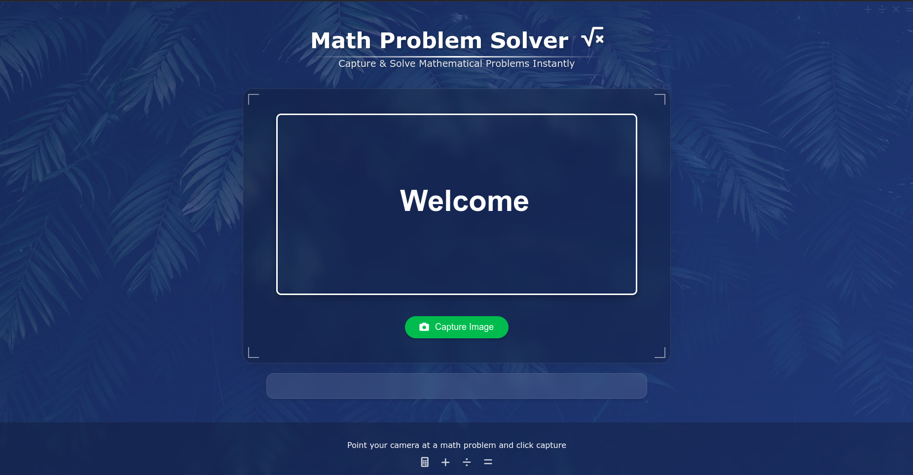

# Math Problem Solver

## Overview
The **Math Problem Solver** is a web-based application that allows users to capture mathematical problems using a camera and instantly get solutions, including step-by-step explanations. The app uses the Google Generative AI API to process images of math problems and generate accurate solutions.

## Features
- **Real-time Camera Capture:** Users can point their camera at a math problem and capture it.
- **AI-Powered Problem Solving:** The app processes the captured image and generates a solution using advanced AI models.
- **User-Friendly Interface:** A clean and interactive UI with floating shapes and intuitive buttons.

---

## Installation

### Prerequisites
1. Install [Python 3.7+](https://www.python.org/).
2. Install [Flask](https://flask.palletsprojects.com/).
3. Obtain an API key from [Google Generative AI](https://developers.google.com/generative-ai).

### Steps
1. Clone the repository from GitHub:
    ```bash
    git clone https://github.com/yourusername/math-problem-solver.git
    cd math-problem-solver
    ```

2. Install required Python packages:
    ```bash
    pip install flask google-generativeai
    ```

3. Add your Google Generative AI API key:
   - Replace the placeholder in `app.py`:
     ```python
     genai.configure(api_key="YOUR_API_KEY")
     ```
     read GET_GOOGLE_API.md for more 

4. Run the Flask app:
    ```bash
    python app.py
    ```

5. Open the application in your browser at [http://127.0.0.1:5000](http://127.0.0.1:5000).

---

## Usage
1. Access the web app.
2. Use your device's camera to point at a math problem.
3. Click the **Capture Image** button.
4. Wait for the solution to appear below the camera feed.

---

## How It Works

### Backend
The backend is powered by a Flask server. Upon capturing an image, the file is sent to the `/process-image` endpoint. The endpoint:
1. Saves the uploaded image.
2. Sends it to the Google Generative AI model for processing.
3. Returns the solution as a JSON response.

### Frontend
The frontend is designed with HTML, CSS, and JavaScript:
- HTML structure (`index.html`) provides the layout.
- CSS (`static/style.css`) styles the page, adding floating shapes and clean typography.
- JavaScript handles camera operations and image capture.

---

## Screenshots

### Interface Overview


---

## Future Improvements
- Add support for advanced math problems like calculus and differential equations.
- Enhance OCR capabilities for handwritten equations.
- Include voice recognition for spoken math problems.

## License
This project is licensed under the MIT License. See `LICENSE` for more details.
